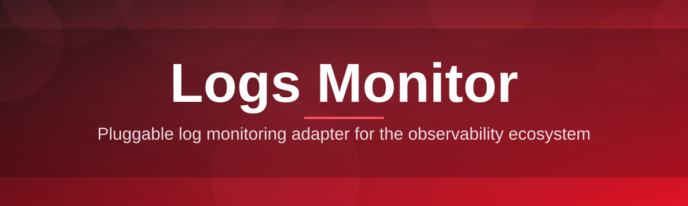
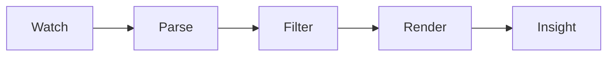

# logs-monitor-dashboard 📊🪵

  

*Your logs, finally readable — a live dashboard that turns raw text streams into signal.*

  

## 🔭 Overview

Every application eventually starts talking to itself in the form of logs — thousands of lines a minute, scrolling past faster than any human can parse. **logs-monitor-dashboard** exists to close the gap between "the logs exist" and "you understand what happened." It's a standalone Windows application that tails, parses, and visualizes log files in real time, turning terminal-speed noise into a calm, structured view you can actually act on.

This project was built for the people who live in log files every day: backend engineers chasing down a stray exception, SREs watching a rollout for regressions, QA teams verifying a build behaves, and hobbyists running home servers who just want to know *what happened at 3am*. Rather than asking you to ship logs to a hosted service or spin up a heavyweight stack, logs-monitor-dashboard runs entirely on your machine — one executable, zero setup, full control over your own log monitor pipeline.

Under the hood, it treats log monitoring as a first-class UX problem, not an afterthought. Severity levels get color, patterns get grouped, spikes get flagged, and the noise gets filtered — so the dashboard reads more like a story of your system's behavior than a wall of text.

> [!NOTE]
> logs-monitor-dashboard is a local desktop tool. Nothing you open is uploaded anywhere — your log monitor session stays on your machine, always.

---

## ⚡ What It Actually Does

- **Live tailing, without the lag** — streams log files as they grow, no polling delay, no dropped lines even under heavy write bursts.

- **Severity-aware coloring** — ERROR, WARN, INFO, DEBUG and custom levels get distinct visual weight so your eyes land on what matters first.

- **Pattern grouping** — repeated log lines collapse into a single counted entry instead of flooding the view, a small feature that saves real scrolling time.

- **Regex & keyword filtering** — build filters on the fly to isolate a request ID, a module name, or a failure signature across gigabytes of history.

- **Spike detection** — a sudden jump in error frequency gets surfaced visually, so regressions don't hide in the scroll.

- **Multi-source panes** — watch several log files or streams side by side, each in its own synchronized pane.

- **Session bookmarks** — mark a moment in the timeline and jump back to it later, useful when reproducing an intermittent bug.

- **Exportable views** — save a filtered, annotated slice of your logs monitor session as a clean text or CSV snapshot for a bug report or postmortem.

> [!TIP]
> Combine pattern grouping with severity filters when triaging a noisy service — it's the fastest way to find the one ERROR line hiding behind ten thousand DEBUG lines.

---

## 🚀 Getting Started

Getting logs-monitor-dashboard running takes minutes, not a setup guide's worth of steps.

1. **Visit the landing page** using the download button above or below.

2. **Grab the latest build** — a single self-contained executable for Windows.

3. **Run it directly** — no installer wizard, no admin prompt required for standard use.

4. **Point it at a log file or folder** and watch the dashboard populate in real time.

> [!IMPORTANT]
> Always download from the official landing page linked in this README. Builds from other sources are not verified by this project.

---

## 🖥️ System Requirements

| Requirement | Details |
|---|---|
| OS | Windows 10 or Windows 11 (64-bit) |
| Dependencies | None — fully standalone binary |
| Disk space | Under 150 MB |
| RAM | 4 GB minimum, 8 GB recommended for large log volumes |
| Network | Not required for core log monitor functionality |

  

---

## 🧠 How It Works

The dashboard follows a simple pipeline from raw text to readable insight:

1. **File watcher** detects new lines as they're written to disk.

2. **Parser** breaks each line into timestamp, severity, source, and message.

3. **Rules engine** applies your filters, grouping, and spike thresholds.

4. **Renderer** paints the result into the live dashboard view.

> [!NOTE]
> This pipeline runs continuously and incrementally — reopening a huge log file doesn't mean re-reading it from the start every time.

---

## 🧩 Troubleshooting

<strong>The dashboard shows "no data" for a file I know is being written to.</strong>

Check that the process writing the log isn't holding an exclusive lock that blocks read access, and confirm the file path hasn't rotated to a new file name.

<strong>My logs monitor session feels slow with a very large file.</strong>

Enable pattern grouping and narrow your time range — rendering every raw line from a multi-gigabyte file at once is rarely necessary and always slower.

<strong>Color coding for severity levels looks wrong.</strong>

Custom log formats sometimes need a manual severity mapping in Settings — the auto-detector covers common formats but not every framework's convention.

<strong>Windows shows a warning when I first run the executable.</strong>

This is standard for new, less widely-signed builds. Verify you downloaded from the official landing page linked in this README before proceeding.

<strong>Can I monitor logs on a remote machine?</strong>

Point the dashboard at a shared network path or a synced local folder — logs-monitor-dashboard reads local files, so remote sources need to land on disk first.

---

## 🎨 UI / UX Details

logs-monitor-dashboard was designed to be lived in for hours without fatigue — small interface decisions add up.

**Themes**

- Dark (default) — tuned for long monitoring sessions
- Light — for bright environments and screenshots
- High-contrast — accessibility-first color mapping

**Settings worth knowing about**

> [!TIP]
> Settings persist per log monitor profile, so different projects can keep their own filters, themes, and severity mappings.

### Keyboard Shortcuts

| Shortcut | Action |
|---|---|
| `Ctrl + O` | Open a log file or folder |
| `Ctrl + F` | Open the filter / search bar |
| `Ctrl + G` | Toggle pattern grouping |
| `Ctrl + B` | Bookmark current line |
| `Ctrl + E` | Export current filtered view |
| `Ctrl + T` | Switch theme |
| `Ctrl + N` | Open a new dashboard pane |
| `Ctrl + W` | Close active pane |
| `Ctrl + ,` | Open Settings |
| `F5` | Refresh / re-attach to log source |
| `Esc` | Clear active filter |

---

## 🤝 Contributing & Community

logs-monitor-dashboard grew because engineers kept asking the same question: *"why doesn't a good, simple log monitor dashboard already exist?"* Contributions, issue reports, and feature ideas are always welcome.

- Open an issue for bugs, edge cases in parsing, or format requests
- Start a discussion for feature proposals before opening a large pull request
- Small, focused pull requests are reviewed faster than sprawling ones

> [!WARNING]
> Please avoid pasting real production log data containing sensitive information into issues or screenshots — sanitize before sharing.

We're grateful to everyone who has filed an issue, suggested a shortcut, or just starred the repo to help others find it.

---

## 📄 License

Released under the [MIT License](LICENSE), 2026.

---

## ⚠️ Disclaimer

logs-monitor-dashboard is provided as-is, for observability and diagnostic purposes. It is a viewing and analysis tool — it does not modify, delete, or transmit the log files it reads. Always follow your organization's data-handling policies when monitoring logs that may contain sensitive information.

